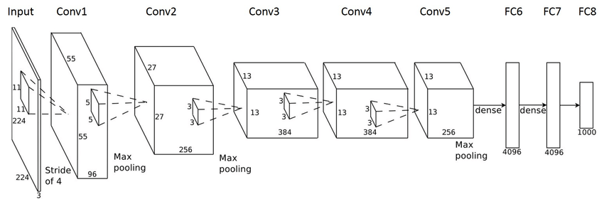
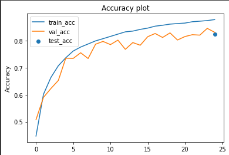

# Implementation of AlexNet, VGG and ResNet

Implementation and comparison of non-pretrained AlexNet, VGG and ResNet on CIFAR10 dataset.

Each model is implemented in pytorch and trained from scratch. The purpose of this project was to implement/learn these models and see how they perform on CIFAR10 dataset.

## Dataset overview

CIFAR10 dataset consists of 10 classes and has 60k images. It is one of the most widely used models.

## AlexNet

AlexNet is one of the most famous CNN architectures for image classification. Initially winning ImageNet challenge in 2012 it quickly rose to the top.

AlexNet consists of eight trainable layers, with five of them being convolutional, one max pooling and three fully connected layers. For the activation, the model uses Relu function.

You can get the pretrained model on the ImageNet dataset, but for the purpose of this project the model was implemented from scratch.

### Results - AlexNet

While higher accuracy and lower loss could be achieved with using the pretrained model, and searching for the optimal parameters, that was not the point of this project.

Loss and Accuracy:

As we will see, the AlexNet model still holds up its own against his predecessors. With differences between them being negligible.

Here we can also the predictions from model.

## ResNet

ResNet is like AlexNet used as a backbone for many computer vision tasks and like AlexNet, ResNet was winner of ImageNet challenge.

Residual networks use special skip connection (shortcut) to jump over some layers.

Another features of ResNet is that we can have different depth depending on the number of blocks we choose.

Implementarion for CIFAR10 dataset differs a bit from the regular ResNet implementation, the downsampling is done a bit differently.

This implementation consists of convolutional, batch normalization, average pooling, fully connected, relu activation layer and three blocks. Where each block consists of two convolution layers and two batch normalization layers with skip connection.

### Results - ResNet

While higher accuracy and lower loss could be achieved with using the pretrained model, and searching for the optimal parameters, that was not the point of this project.

Loss and Accuracy:

Here we can also the predictions from model.

## VGG

Similar to its predecessors, VGG model is one of the leading models in the field of object recognition. VGG was inspired by the AlexNet model, but it's much deeper.

VGG models can have different configurations. The model used in this project is VGG11.

### Results - VGG

While higher accuracy and lower loss could be achieved with using the pretrained model, and searching for the optimal parameters, that was not the point of this project.

Loss and Accuracy:

Here we can also the predictions from model.

